# Repositories

*Source Code Management* is an essential process of the software development. Source code can be be changed by different developers, event different development teams, each team or developer creating its own version of the same feature. The biggest pitfall lies in deployment process where the changes made must be integrated in a controlled and consistent manner. 

*Connected* provides its very own *Source Code Management* system, names **Repositories**. It a central, cloud based versioning system, integrated directly into [Development Environment](../IDE/README.md).

It provides all features you'd expect from a modern versioning system. 

Every [Subscription](../Environment/Subscription.md) has its own *Repositories* system where a [Subscription](../Environment/Subscription.md) specific source code of the [Microservices](../Microservices/README.md) can be hosted.

The only way to transfer code changes between [Instances](../Environment/Instance.md) is by using *Repositories*.

## Repository

A *Repository* represents a [Microservice](../Microservices/README.md). One [Microservice](../Microservices/README.md) equals to the one *Repository*. This means each [Microservice](../Microservices/README.md) can be hosted in exactly one [Subscription](../Environment/Subscription.md). If you need to perform changes to the [Microservice](../Microservices/README.md) which is hosted in a different [Subscription](../Environment/Subscription.md) you can create a new *Branch* and manage your changes independently.

A *Repository* can be **Public** or **Private**. By default and by following Tom PIT [Open License](https://www.tompit.com/legal) your work should be open sourced unless you own a commercial license which means a *Repository* should be **Public**.

### Create a Repository

You've created a new [Microservice](../Microservices/README.md), wrote some code and now you want to [Deploy](README.md) it to the [Production](../Environment/Production.md) [Instance](../Environment/Instance.md).

In the bottom right corner of the [IDE](../IDE/README.md) is the *Repositories* status bar with the following commands:

- Credentials
- Push
- Commits
- Pull
- Merge Request
- Branch

The following image shows the status bar:
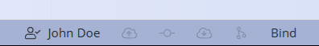

#### Credentials

Before you can use the *Repositories* you must connect your local credentials with the [Connected Portal](../Environment/ConnectedPortal.md). This is how your status bar would look like if you are not authenticated in the [Connected Portal](../Environment/ConnectedPortal.md):

If you don't have a valid *Connected* account it's time to get one. To create an account, follow the steps in the [Connected Portal](../Environment/ConnectedPortal.md).

Once you have a valid account, click on an **Not Authenticated** button. A *Designer* opens up asking for a *Connected* credentials:
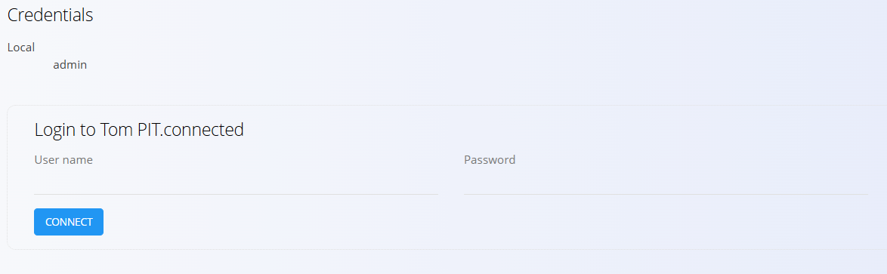

Enter *Connected* credentials and clock on a **Connect** button. If you've entered a valid credentials you will see your name displayed in the status bar.

You can now proceed with the creating a *Repository*. Click on a **Bind** button and a **Create Repository** designer will show up

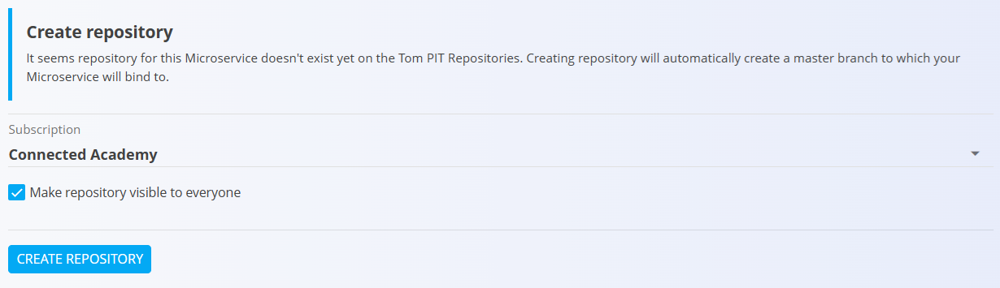

In the **Subscription** select box you you will see all Subscriptions you have access to. Choose the `Subscription` carefully because you cannot move the *Repository* between subscriptions and each Microservice can be hosted in only one *Repository*.

By default, a **Make repository visible to everyone**  check box is checked meaning that your *Repository* will be public. All of your *Repositories* should be public unless you own a *Connected* commercial license.

## Push

Once your *Microservice* is bound to the remote *Repository* you can start committing your work remotely. This way there is no danger of losing your work locally so perform commit as often as possible to avoid losing your changes.

if you click on the **Push** button on the status bar the designer opens up.

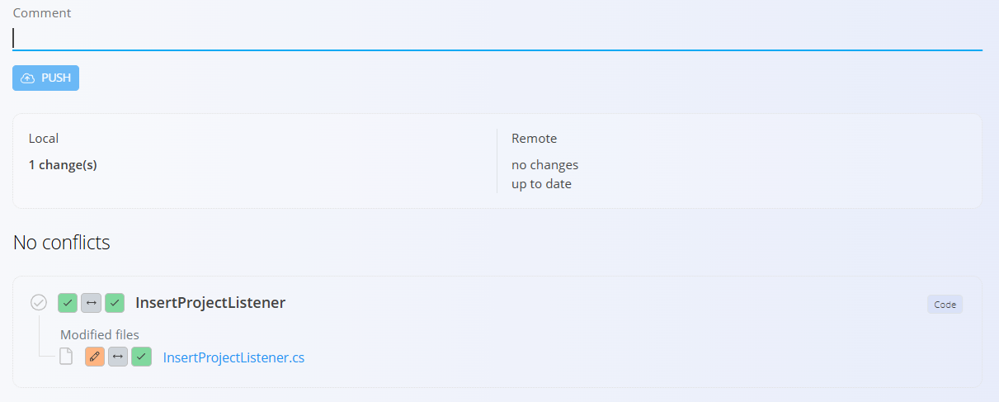

*Connected* performs a comparison between your local state and the remote one in the *Branch* the *Microservice* is bound to. Once the comparison is complete the designer shows all changes between your local and remote versions. If there are conflicts *Connected* will display a warning and you must resolve all conflicts before a push will be allowed to execute.

The designer expects a commit message to be entered before the **PUSH** button is enabled.

A section below a text box is showing local and remote statistics, for example how many changes you've made locally or how many commit(s) you are behind the remote.

In the bottom pane changed files are listed. Each file has two `verbs`, a local and a remote. Local `verb` is showing what kind of change has been made locally and the remote `verb` is showing what kind of change has been made `remotely` respectively. A verb can contain the following values:

- No Change
- Edit
- Add
- Delete

if you click on the file name a new designer opens up displaying a changes made to the source code.

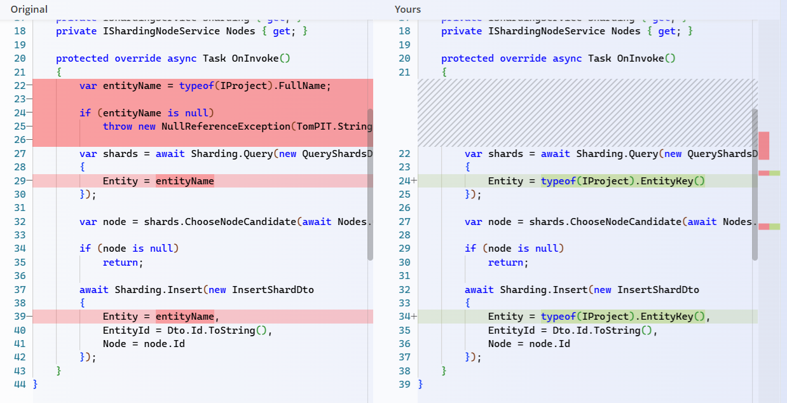

This way you can see what kind of changes have been made to make sure everything is as expected.

> *Connected* will automatically merge changes to the source file if there are not conflicts. If two users made changes to the same line in the source code it will be considered a **Merge Conflict** and you'll have to perform a manual merge.

Left and right panes can be switched and the typically show an older change to the newer one. if the remote version is older it will be displayed on the left and on the right otherwise.

Once you are happy with changes, all conflicts have been resolved and you've entered a comment text, you can click on the **PUSH** button.

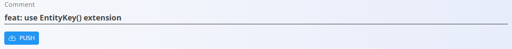

*Connected* will perform a commit and once completed it will display a successful message.

At this point your changed are posted remotely and merged with the currently bound *Branch*.

Behind the scene the *Connected* first performs a **Pull** command before performing a **Push**. This means that once the *Push* has completed you have all remote changes synchronized locally. And it also means you can't perform a *Push* without performing a *Pull*.

## Managing Conflicts

//TBD

## Commits

**Commits** command enables to view the history of changes made to the current *Branch*. You can see for each commit who performed it, when and which files were changed. On top of the commits you can see the list of users who participated to the current *Branch*.

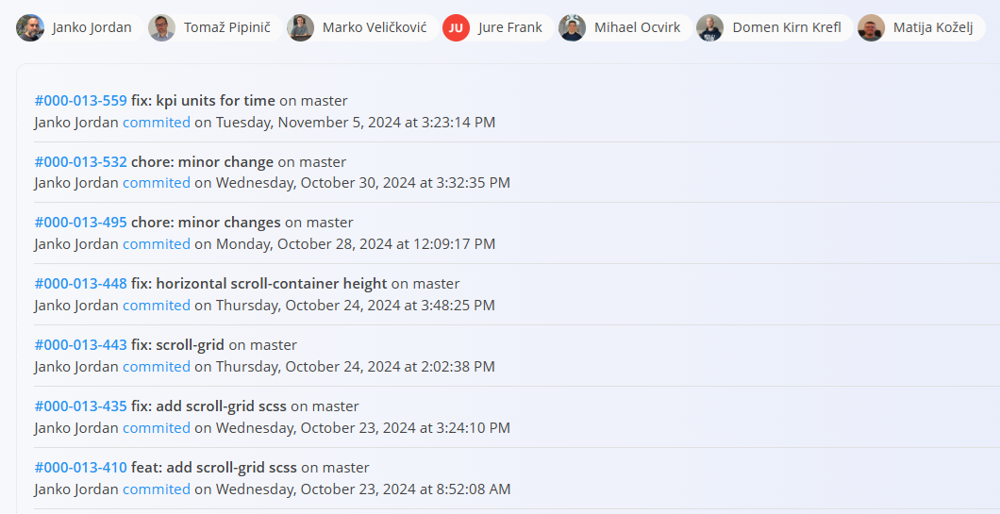

Commits are ordered from newest to oldest. If you click on the **commit number** link a designer opens up displaying changed files in the selected commit.

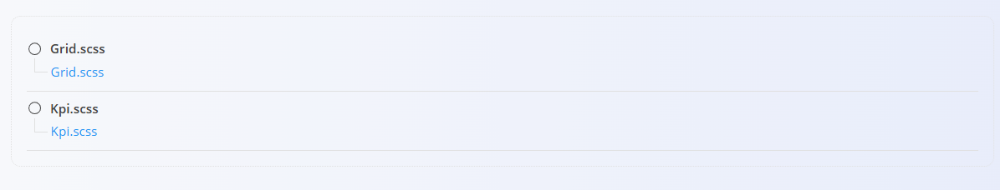

If you click on the **file name** link, a designer opens up displaying changes to the source code.

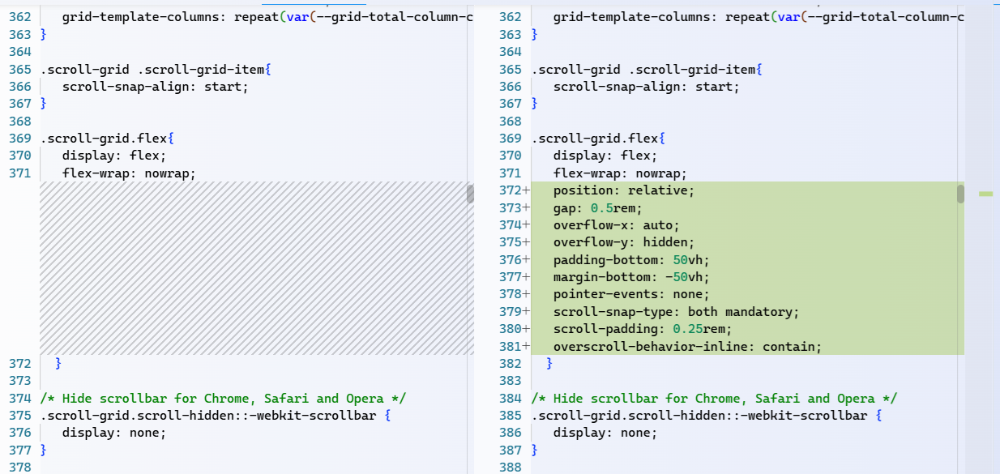

## Pull

A **Pull** command synchronizes remote changes with local ones without pushing the local changes remotely. 

If you click on the **Pull** command a designer opens up which is very similar the the *Push* designer.

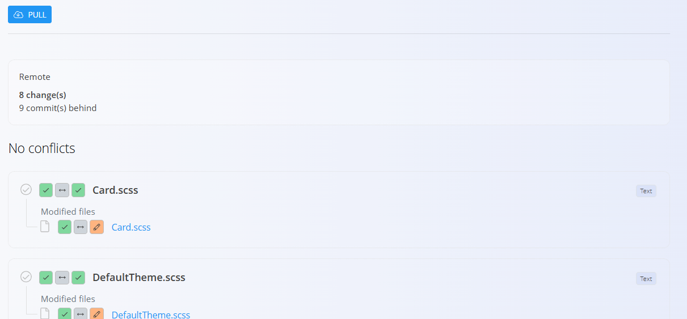

You can see how many changes are found remotely and how many commits you are behind the latest commit in the current *Branch*. By clicking on the file name you can see what changes have been made remotely.

By clicking on the **PULL** button the remote changes will be merged locally.

## Merge Request

## Branches

Development of a new feature can take some time. While the development progresses, occasional commits are performed to save developer's work remotely and to enable quality engineers to pull changes and perform tests. But in the mean time, other developer can work on a different feature on the same Microservice who performs commits as well. A clash of features occur, quality engineer retrieving features which he didn't want ot event committed work that doesn't compile and causes a system to stop working.

To avoid this kind of accidents, *Connected* provides a feature called **Branching**. A *Branch* is an isolated version of the *Microservice*. Every *Repository* contains at least one *Branch*, called **master**, which is automatically created along with *Repository*. **master** *Branch* cannot be deleted. Each *Branch* can have child branches which means that each child branch have its parent except the **master** *Branch*.

Creating a new *Branch* means performing a Clone. Clone means a child *Branch* is created from the parent *Branch* which serves as the origin to the newly created *Branch*. Any changes made to the parent *Branch* from the point of creation of the child *Branch* are not visible the any of child *Branches*. Opposite os also true, changes performing on the child *Branch* are not visible to it parent.

Once the work on the is completed the **Merge Request** process is started. Developer performs a *Merge Request* and authorized user in the *Repositories Server* performs a manual merge. Once the changes are merged a new commit is created in the parent branch meaning the parent accepted the changes from the child branch.

A *Microservice* can be bound to only one *Branch* at the same time. You can see the currently bound *Branch* in the right side of the status bar.

If you click on the **Branch** button a designer opens up showing all branches for the *Microservice*. If you click on the **Branch Name**, several options are shown and they depend on which branch is active.

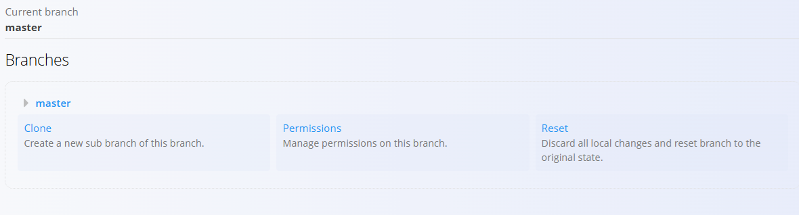

### Clone

### Permissions

### Reset
