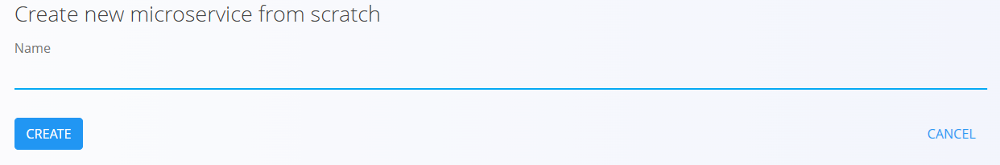
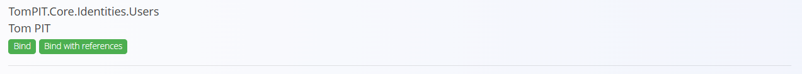

# Create Microservice

The first thing to do regarding development is to create a [Microservice](../../Microservices/README.md). Microservice represents the root building block where all [Digital Content](../../Environment/DigitalContent.md) reside.

Microservices are created in the [IDE](../../IDE/README.md). Once your environment is up and running, enter the *IDE* by typing the following address into the web browser:

```
http://[HOST]/sys/development/local/microservices
```
where `HOST` is the address of you instance, for example `localhost:44003`.

Once you've successfully reached the address, a page with existing *Microservices* is displayed.

To create a new *Microservice*, click on the `+` floating button in the bottom right corner of the screen. You are redirected to the **Create Microservice Screen** where you have two options:

- Create *Microservice* from Scratch
- Bind Existing *Microservice* from the [Repositories](../../Deployment/Repositories.md)

## Create from Scratch

If the Microservice you'd like to create doesn't exists on the *Repositories* yet, you might want to choose this option. If you click on the **Create from Scratch** button an inline edit form is shown.

.

Enter the **name** of the *Microservice*, for example **Connected.Academy.CreateMicroservice** and click on the **CREATE** button.

A new *Microservice* is created and the *IDE* shows the development environment for the newly created *Microservice*.

## Bind Existing

If the *Microservice* already exists in the *Repositories* you should search for it and click on the one of the two options:

- Bind
- Bind with References



If you choose **Bind** option the *Microservice* will be created but if the *Microservice* has references to other *Microservices* you have to bind those references manually. **Bind with References** with also bind all all references from the *Repository* which is the option you'd choose in most cases.