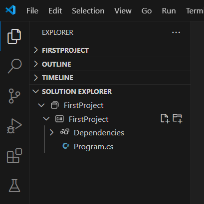
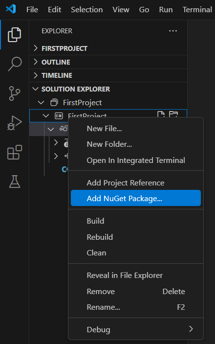

# Create Microservice

A [Microservice](../../Microservices/README.md) is typically a *Class Library* which is referenced by an *Executable* containing one ore more Microservices forming a *Server Application*.

A Microservice can also be an *Executable* directly because there is actually no technical difference between a *Class Library* Microservice and an *Executable* Microservice.

In this example we'll create an *Executable* Microservice. You can use *IDE* of your choice but *Connected* documentation uses *Visual Studio Code* because it's supported on all popular operating systems, *Windows*, *Linux* and *Mac*.

> [!NOTE]
> You must have **C# Dev Kit** extension for *Visual Studio Code* installed in order to manage ```C#``` projects and solutions.

To create an *Executable* follow this steps:

1. Start *Visual Studio Code*
2. Open Explorer
3. Click **Create .NET Project***** button in the explorer's tool window
4. Choose **Console App** from the list of available project templates
5. A *Project Location Modal* is shown. Choose a folder where you want your project to be created
6. Name your project, for example **FirstProject**, press **Enter** and press **Enter** again to confirm the selection

At this point you have a valid .NET *Console Application*. If you expand the *Solution Explorer* pane you will see a project structure similar to the image below.



The project can be compiled and executed because it is a perfectly valid .NET *Executable* program. There is nothing special about it because it's basically just a .NET project. To make a project *Connected* like, a project which supports all of the platform features, you need to add one of the following *NuGet* packages:

- [Connected.Runtime](https://www.nuget.org/packages/Connected.Runtime)
- [Connected.Sdk](https://www.nuget.org/packages/Connected.Sdk)

Those two packages differs from the usage. ```Sdk``` package is used in *Class Libraries* and contains all the necessary tools and services needed to develop Microservices but contains no implementation libraries. It's simply a *Software Development Kit*. A ```Runtime``` package is used by executables because it contains, in addition to all of the features ```SDK``` provides, default implementations of the [Core](../../Environment/Core.md) models which are needed for the *Connected* server application to successfully start.

> [!WARNING]
> You should never reference a ```Runtime``` package in *Class Libraries* because this would create a direct dependency to the implementation services and you would end up with a tightly coupled system that is against the *Connected* guidelines.

In this example we've created an *Executable* so it is safe to reference a ```Runtime``` package. Right click on the project as shown in the image below.



Enter **Connected.Runtime** in the text box, select **Connected.Runtime** from the list, select version and press **Enter**. The package reference is added to the project.

> [!NOTE]
> *Visual Studio Code* displays only non prerelease packages by default. If you want to add a prerelease *Connected* package, see [Visual Studio Package Management](https://code.visualstudio.com/docs/csharp/package-management) how to display prerelease versions of NuGet packages.

## Database
*Connected* needs a database even if you don't have any [Entities](../../ServiceLayer/Entities/README.md) in your Microservices because the platform itself comes with several entities that require a permanent storage, such as ```Users``` or ```Settings```. Now is a good time to create a database in your database server which will be used by your first project.

## ```appsettings.json```

If you are creating an *Executable* you also need to provide a few basic settings because it's an application that will host and run Microservices. If you've created a *Class Library* you can skip this step.

Add a new file to the project by selecting **Custom file** from the list and name it **appsettings.json**.

Paste the following code in the file:

``` json
{
    "startOptions": "synchronizeSchemas",
    "storage": {
      "databases": {
        "defaultConnectionString": "data source=***;initial catalog=***;integrated security=true;TrustServerCertificate=true;MultipleActiveResultSets=True;"
      }
    }
  }
```

Replace *** values with properties from your database server and a database you've created earlier.

Now click on the project in the Solution explorer and the ```xml``` will open. Paste the code below just before the ```</Project>``` closing tag.

``` xml
  <ItemGroup>
    <None Remove="appsettings.json" />
  </ItemGroup>

  <ItemGroup>
    <Content Include="appsettings.json">
      <CopyToOutputDirectory>PreserveNewest</CopyToOutputDirectory>
    </Content>
  </ItemGroup>

```
Congratulations, you are ready to start develop Microservices.

## Next Steps

- [Hello World](HelloWorld.md)
